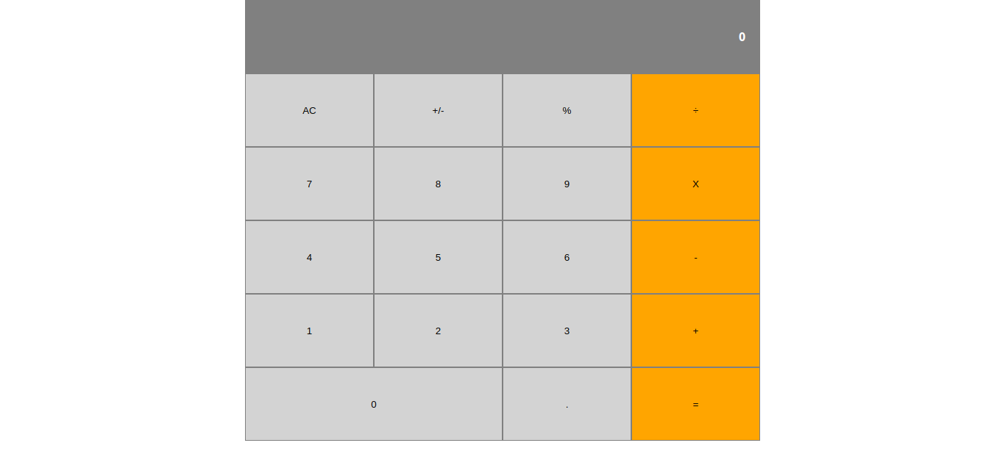

# Calculator

> Simple Calculator 

All the simple operations are implemented

A full description of the project can be found [here](https://www.theodinproject.com/courses/web-development-101/lessons/calculator)

## Built With

- HTML5
- CSS3
- Javascript
- React.js

## Live Demo

[Live Demo Link](https://mverse-js-calculator.herokuapp.com/)

## Getting Started

### Prerequisites

You need to have these softwares and tools installed

- Node.js
- Yarn / NPM

### Setup

To get a local copy up and running follow these simple example steps.

- Clone the repository `git clone https://github.com/maelfosso/microverse_js_calculator`
- Change your current directory `cd microverse_js_calculator`
- Install all the dependencies `yarn install`
- Start the app `yarn start`

## Authors

👤 **Mael FOSSO**

- GitHub: [@maelfosso](https://github.com/maelfosso)
- Twitter: [@maelfosso](https://twitter.com/maelfosso)
- LinkedIn: [LinkedIn](https://www.linkedin.com/in/mael-fosso-650b6346/)

## 🤝 Contributing

Contributions, issues, and feature requests are welcome!

Feel free to check the [issues page](issues/).

## Show your support

Give a ⭐️ if you like this project!

## 📝 License

This project is [MIT](lic.url) licensed.
